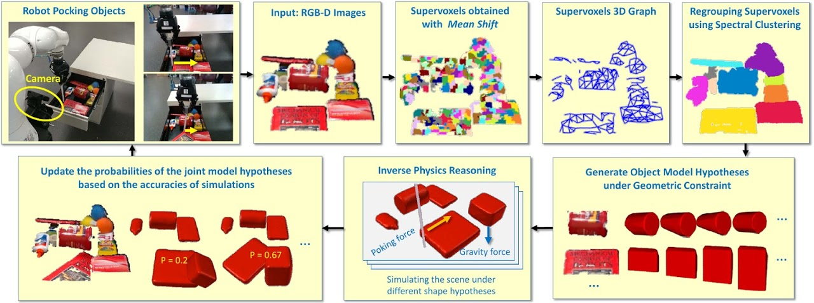
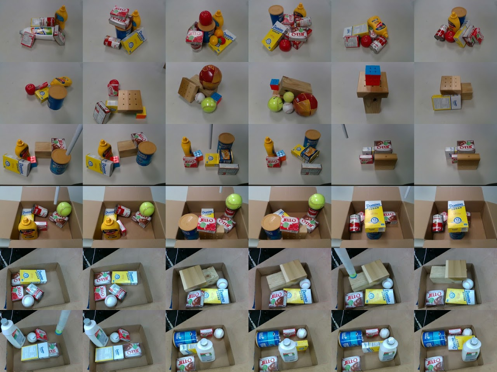
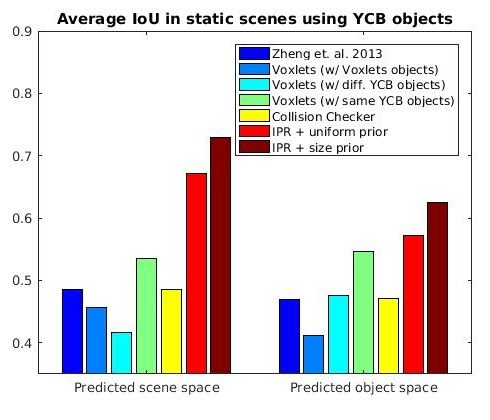
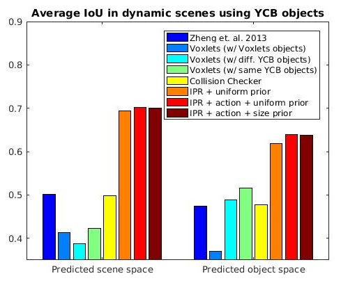
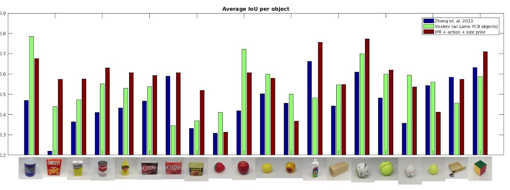

# Inferring 3D Shapes of Unknown Rigid Objects in Clutter through Inverse Physics Reasoning

Changkyu Song and Abdeslam Boularias, Inferring 3D Shapes of Unknown Rigid Objects in Clutter through Inverse Physics Reasoning, IEEE Robotics and Automation Letters (RA-L 2018) and presented in IEEE International Conference on Robotics and Automation (ICRA 2019) Montreal, Canada. [[PDF]](https://arxiv.org/abs/1903.05749) [[Poster]](https://drive.google.com/file/d/1Eo1S7u3rK_BlIz3cMrRMtFDSTFvnYJKB/view?usp=sharing) [[Video]](https://www.youtube.com/watch?v=lQ9-OEku8vM) [[Webpage]](https://sites.google.com/site/changkyusong86/research/ralicra2019) [[Article in Tech Xplore]](https://techxplore.com/news/2019-03-d-unknown-robots.html?fbclid=IwAR1nVMki73R_12EArLhMbArldWgkt9hwrjQz_9DL2k2UHMKE5GCwloVqXNo)

We present a probabilistic approach for building, on the fly, 3-D models of unknown objects while being manipulated by a robot. We specifically consider manipulation tasks in piles of clutter that contain previously unseen objects. Most manipulation algorithms for performing such tasks require known geometric models of the objects in order to grasp or rearrange them robustly. One of the novel aspects of this work is the utilization of a physics engine for verifying hypothesized geometries in simulation. The evidence provided by physics simulations is used in a probabilistic framework that accounts for the fact that mechanical properties of the objects are uncertain. We present an efficient algorithm for inferring occluded parts of objects based on their observed motions and mutual interactions. Experiments using a robot show that this approach is efficient for constructing physically realistic 3-D models, which can be useful for manipulation planning. Experiments also show that the proposed approach significantly outperforms alternative approaches in terms of shape accuracy.

# Pipeline

# Dataset

Our dataset with YCB objects includes the tabletop scenes as well as piles of objects inside a tight box that can be seen in the attached video. Objects in this dataset are severely occluded. We split the dataset into two subsets, one with only static scenes and another with only dynamic ones. Static scenes are 12 in total. Dynamic scenes, 13 in total, include at least one robotic pushing action per scene. The dataset contains the color and depth images as well as our segmentation results and their ground truth volume occupancy. You can download the dataset [[HERE]](https://drive.google.com/file/d/1yhG99jXpBgQ0GaNy3Qq7QH8FZBymzvrb/view?usp=sharing)

# Results

# Author

[Changkyu](https://sites.google.com/site/changkyusong86) (changkyusong86@gmail.com)
